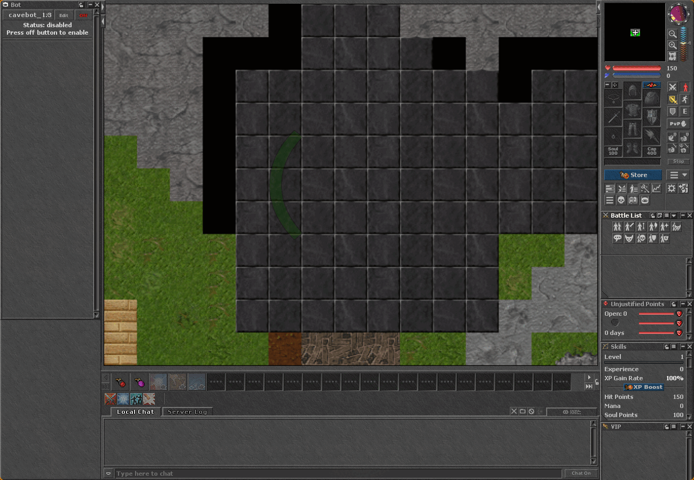

# The Crustacean Server 🦀

An Open Tibia server written in Rust — protocol **10.98**, targeting the **OTClient Redemption** client.



> A real OTClient connects, logs in, and renders a character on the actual `forgotten.otbm` map. No emulator tricks — genuine protocol, genuine map data.

## Why

A from-scratch, memory-safe Tibia server. Every crate is `#![forbid(unsafe_code)]`, the protocol is verified byte-for-byte against the real client, and TFS 1.4.2 is used only as a spec reference — never ported line by line.

## Quick start

```bash
cargo build && cargo test
RUST_LOG=info cargo run -p server -- config/server.toml
```

Then point OTClient Redemption at `127.0.0.1:7171` and log in with `test` / `test`.

## Roadmap

| # | Goal | State |
|---|------|-------|
| M0 | Skeleton: workspace, listeners on 7171/7172, connection logs | ✅ |
| M1 | Login server: framing, Adler-32, RSA, XTEA, char list | ✅ |
| M2 | Formats: `.otb` + `.otbm` parsers | ✅ |
| M3 | Enter game: handshake, player load, render the real map | ✅ |
| M4 | Walk: movement, tile updates, floor changes, collision | ⬜ |

Combat, Lua scripting, and creatures come after M4.

---

Built with strict TDD. See `PROGRESS.md` for the full milestone log and protocol notes.
